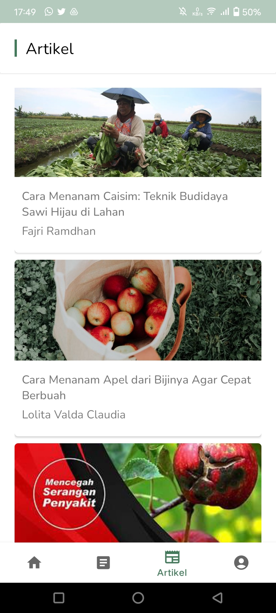

# Apani App

Apani : Apani (Aplikasi Pak Tani) GitHub Repositories of Bangkit Academy 2023 Capstone Project from 3 learning path. Machine Learning, Mobile development, Cloud Computing from team C23-PS372.

# About The Project

Apani is a mobile application designed specifically for farmers to assist them in various aspects of agriculture. The project aims to leverage technology to provide farmers with valuable tools and information that can enhance their productivity and decision-making processes. By utilizing machine learning, data analysis, and real-time data, Apani offers features such as crop recommendation, plant disease detection, and weather prediction.

# Project Objectives

The primary objectives of the Apani project are as follows:

1. **Crop Recommendation**: The app provides personalized crop recommendations based on the user's geographical location. By analyzing factors such as tempereratur, air humidity, and weather prediction, Apani helps farmers make informed decisions about the most suitable crops to grow.

2. **Plant Disease Detection**: Apani utilizes machine learning algorithms and image processing techniques to detect and identify plant diseases. By capturing images of affected leaf of plants, the app can provide farmers with timely and accurate diagnoses, enabling them to take appropriate measures to mitigate the spread of diseases.

3. **Weather Prediction**: Apani incorporates weather data to provide farmers with accurate and localized weather forecasts. By accessing real-time weather information, farmers can plan their agricultural activities more effectively, such as irrigation scheduling, planting, and harvesting.

4. **Educational Articles**: The app includes a repository of informative articles on various agricultural topics. These articles aim to educate farmers about modern farming techniques, best practices, and innovative approaches to maximize their crop yields and profitability.

5. **Project Management**: Apani also offers project management capabilities, including a to-do list and note-taking functionality. Farmers can create and manage tasks, set reminders, and organize their agricultural projects more efficiently. Additionally, the note-taking feature allows farmers to jot down important information, observations, or ideas related to their farming activities.

	 &nbsp; &nbsp; &nbsp;
	 &nbsp; &nbsp; &nbsp;
	 &nbsp; &nbsp; &nbsp;
	

# Team Members

## Team ID : C23-PS372

 

| Name                                  | Student ID    | Path                |
| ------------------------------------- | ------------- | ------------------- |
| Fahrendra Khoirul Ihtada              | M192DKX4754   | Machine Learning    |
| Angelina Patricia Sondakh Simbolon    | M151DSY3423   | Machine Learning    |
| Rabiatul Fitra Aulia                  | A066DSY2106   | Android Development |
| Rizha Alfianita                       | A192DKY4610   | Android Development |
| Muhammad Hibban Syakir                | C066DSX0944   | Cloud Computing     |
| Alvin Aldorino Setiawan               | C066DSX3278   | Cloud Computing     |

 

# Resource

In our project is divided into four branches.

1. [main](https://github.com/FahrendraKhoirul/Apani_BangkitCapstone/tree/main)
2. [android-development](https://github.com/FahrendraKhoirul/Apani_BangkitCapstone/tree/android-development)
3. [cloud-computing](https://github.com/FahrendraKhoirul/Apani_BangkitCapstone/tree/cloud-computing)
4. [machine-learning](https://github.com/FahrendraKhoirul/Apani_BangkitCapstone/tree/machine-learning)

# Getting Started

- **Prerequisites**

  1.  Android
  2.  Internet connection
  3.  GPS/Location

- **Installation**

  1.  Download the APK
  2.  Install the APK

- **Register**

  1.  Open Apani application
  2.  Register your email address

# Usage
To use the Apani mobile application, follow these steps:
1. Download the APK file from the latest release available on the GitHub repository.
2. Transfer the APK file to your Android device and install the APK.
3. Once the app is running, you will be presented with the main screen, where you can access various features:
    - Crop Recommendation: Click on the "Crop Recommendation" section to receive personalized crop recommendations based on your geographic location. 
    - Plant Disease Detection: Navigate to the "Plant Disease Detection" section to identify plant diseases. Capture an image of leaf of an affected plant, and the app will use machine learning algorithms to analyze the image and provide a diagnosis.
    - Educational Articles: Explore the "Articles" section to access a wide range of informative articles on agriculture. Read and gain knowledge about various topics related to farming techniques, best practices, and innovative approaches.
    - Project Management: To manage your agricultural projects, utilize the this features. Create tasks, set reminders, and take notes to stay organized and keep track of important information.
5. Enjoy using the Apani app and make the most of its features to enhance your farming experience and productivity!

# Product

1. [Apani Apps]()

 

# Technology Used

1. Machine Learning
   - [Tensorflow](https://www.tensorflow.org/)
   - [Python](https://www.python.org/)
   - [Google Colaboration](https://colab.research.google.com/?utm_source=scs-index)
2. Android Development
   - [Kotlin](https://kotlinlang.org/)
3. Cloud Computing
   - [NodeJS](https://nodejs.org/en/)
   - [Google App Engine](https://cloud.google.com/appengine)
   - [Google Cloud SQL](https://cloud.google.com/sql)
   - [Express Framework](https://expressjs.com/)
4. Design
   - [Figma](https://www.figma.com/team_invite/redeem/0OSnbfja9god45i9k8pj6c)
      

# API Documentation

For API documentation, see the following link [RESTful APIs Apani](https://github.com/FahrendraKhoirul/Apani_BangkitCapstone/tree/cloud-computing#readme)

# Acknowledgments

